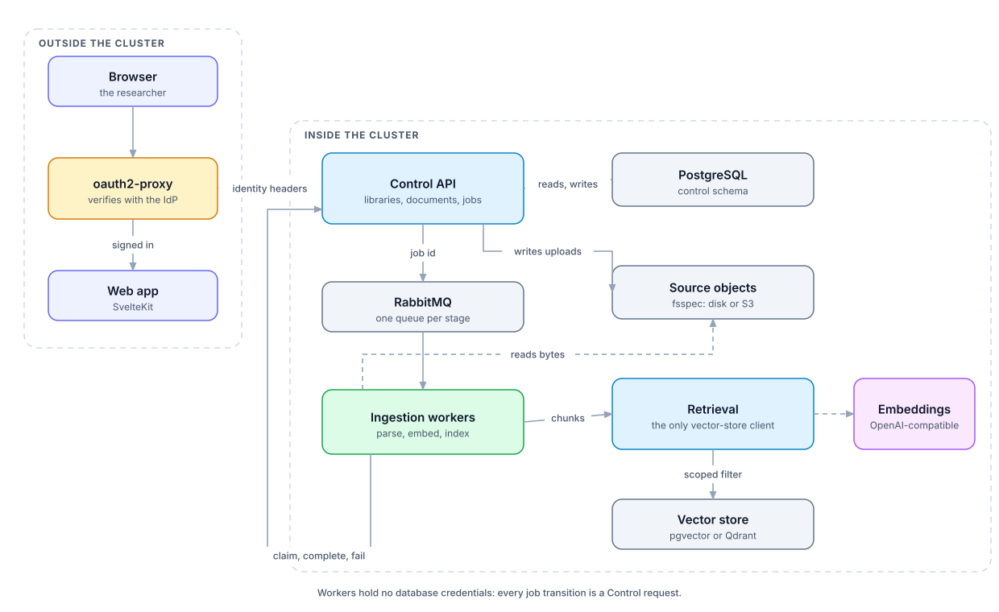

<div align="center">

# Primer

[](https://github.com/isaiah-harville/Primer/actions/workflows/ci.yml)
[](https://github.com/isaiah-harville/Primer/releases)
[](https://isaiah-harville.github.io/Primer/)
[](https://github.com/isaiah-harville/Primer/pkgs/container/charts%2Fprimer)

</div>

---

Primer is a self-hosted, multi-user assistant for your own documents. You put
sources into private libraries; it answers from those libraries alone, and
every claim points back at the passage it came from.

It exists for people who cannot or will not send their documents to a hosted
service. Everything runs on your infrastructure, against your own model
endpoints. **Primer ships no model and calls no vendor.**

<div align="center">



</div>

## What it does

|  | |
|---|---|
| **Private by default** | A library belongs to one person. Nobody else can read it, list it, or discover that it exists. |
| **Real documents** | `.pdf` `.docx` `.pptx` `.md` `.markdown` `.txt` — including text that exists only inside images. |
| **Answers you can check** | Every citation names a passage in a specific *version* of a specific document, and is recorded with the answer rather than recomputed later. |
| **Your models** | Any OpenAI-compatible endpoint — vLLM, Ollama, llama.cpp, or a hosted API. |
| **Chat on its own** | Use it as a plain chat interface, and link a library when you want the answer grounded and cited. |
| **Tools, only with consent** | MCP tools run in the operator's own servers, and only after a person approves that specific call. Primer never touches the host shell. |

## Local quick start

Primer needs an OpenAI-compatible endpoint for chat and for embeddings. It
does not provide one.

```bash
git clone https://github.com/isaiah-harville/Primer.git
cd Primer

cat > deploy/compose/.env <<'ENV'
POSTGRES_PASSWORD=change-me
RABBITMQ_PASSWORD=change-me
PRIMER_INTERNAL_API_TOKEN=change-me
PRIMER_CHAT_BASE_URL=http://host.docker.internal:11434/v1
PRIMER_CHAT_MODEL=llama3.1
PRIMER_EMBEDDING_BASE_URL=http://host.docker.internal:11434/v1
PRIMER_EMBEDDING_MODEL=nomic-embed-text
PRIMER_EMBEDDING_DIMENSIONS=768
ENV

docker compose -f deploy/compose/compose.yaml up --wait
```

Then open <http://localhost:3000>.

> [!WARNING]
> The Compose profile has **no authentication and is not meant to gain any**.
> Every request is the same fixed local user, so anyone who can reach the
> published ports is that user. Keep it bound to localhost.
>
> Multi-user Primer is the Kubernetes deployment, where the ingress, the
> identity provider, and the trusted-header boundary actually exist.

## Hosting it on a server

```bash
helm install primer oci://ghcr.io/isaiah-harville/charts/primer \
  --namespace primer --create-namespace \
  --values my-values.yaml
```

Authentication is generic OIDC through
[`oauth2-proxy`](https://github.com/oauth2-proxy/oauth2-proxy). Primer
implements no login flow of its own: it trusts identity headers, and the
ingress strips those headers from anything arriving on the outside so a
caller cannot claim to be someone else.

See [Kubernetes](https://isaiah-harville.github.io/Primer/operations/kubernetes/)
for what the chart expects.

## Published artefacts

| Artefact | Where |
|---|---|
| API image (Control, Chat, Retrieval) | `ghcr.io/isaiah-harville/primer-api` |
| Worker image (parsing, embedding, indexing) | `ghcr.io/isaiah-harville/primer-worker` |
| Web image | `ghcr.io/isaiah-harville/primer-web` |
| Helm chart | `oci://ghcr.io/isaiah-harville/charts/primer` |

Releases publish all four under one version, so a chart at `1.4.0` pulls the
images built from the commit tagged `v1.4.0`. `latest` follows `main` and is
for trying things, not for running them.

## How it fits together

Four processes, each owning one thing.

- **Control API** — what exists, and who may see it. Every authorization
  decision is made here and nowhere else.
- **Ingestion workers** — turn uploaded files into passages. Celery over
  RabbitMQ, with lease-based claims so a worker dying mid-document is
  recoverable rather than corrupting.
- **Retrieval** — the only process that touches a vector store. Every request
  carries a library and a generation; there is no unscoped search to get
  wrong.
- **Web** — SvelteKit, and the only thing a browser talks to.

Reindexing writes a new *generation* and swaps it in atomically, so a rebuild
is invisible until it is complete rather than half-answering questions while
it runs.
